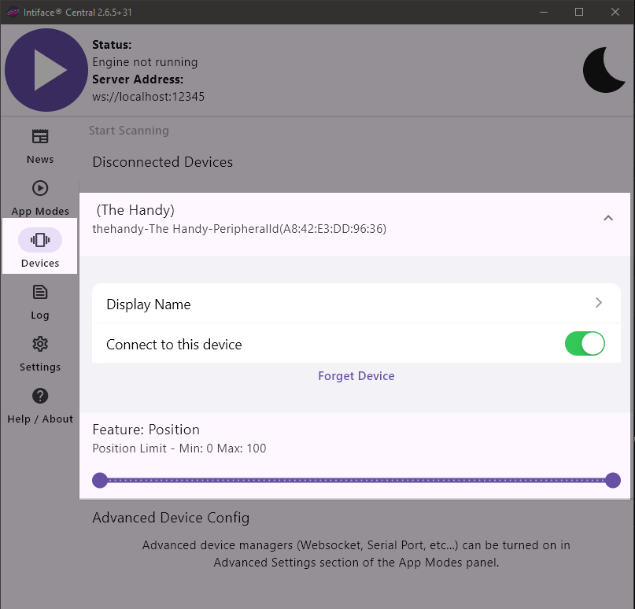

# Script Control

➡️➡️➡️<a href="https://scriptscontrol.web.app/" target="_blank">Link to the web app</a>

:warning: _You need to download and use [Intiface Central](https://intiface.com/central/) to connect your devices through Bluetooth._

## Quick tour

This application allows users to create lists of tracks (scripts or patterns) and easily switch between them with a simple click or a key press, without latency or the need to reload data.

It is also possible to play a video with a synchronized script and change the played track(s) on demand. This way, you can switch to a more dynamic script when the video's action is too calm, or opt for a calmer list when it becomes too intense, or simply delay the climax.

Furthermore, each list can be configured to play tracks randomly, with modification settings to make them more dynamic and less repetitive.

Here is a simple showcase:

 

> As you can see, you can change from the synced script to any non synced.
> The top chart gives you a preview of the currently playing script, and the yellow bar simulates a stroker.

### Limitation

- For now, the application only accepts file extensions `.funscript`, `.scriptscontrol`, and was tested with The Handy.
- You have to use [Intiface Central](https://intiface.com/central/) to connect your devices.
  > Even though this documentation talks about mutliple devices, I don't have any other devices than The Handy to test with, but it should work with any one-axis stroker device.
- Because of Bluetooth latency, fast scripts can have unexpected behavior.
- This app is not designed to render properly on mobile.
- 
## How to connect a device

### From Intiface Central

1. Download and then install [Intiface Central](https://intiface.com/central/).
2. Start Intiface Server.
3. Start the Intiface application, then go to _AppMode_ to check server configurations. The default configuration will be `ws://localhost:12345`, so Script Control is configured with the same default.
4. Run the server, then go to Script Control.
5. Configure Script Control by enabling the Intiface connection with the server address, then click to Connect through _Settings_.

When you're done, a successful connection message should appear.

 

After that, any devices connected via Bluetooth to your desktop should be detected soon and visible in _Intiface Central > Devices_:

 

But also on the top bar of ScriptsControl.

 

## Import script files

Only `.funscript` file format is accepted now :eyes:

You can easily import `.funscript` files by any of the following options:

- The Import/export menu from the top right
- Drop files directly into the new playlist area
- From the menu of an existing playlist

### Chaptered scripts

If the script file contains chapters, every chapter will be automatically imported as a simple track. In that way, patterns creators can create multiple patterns within the same script file :muscle:

For example, [this script](./readme/assets/Chapters.funscript) (created with [OpenFunscripter](https://github.com/OpenFunscripter/OFS)) contains 3 chapters as patterns:
OpenFunscripter view | Imported chapters
:-----------------------------------------:|:-------------------------:
 | 

## Playlists

Playlists can be managed from the Playlist page.

A playlist will play all the tracks it contains in order or shuffle mode. The order of the tracks can be changed by drag and drop:

A smooth transition is added between tracks when needed:

|                      Current track                       |                         Next track                          | Result                                                                  |
| :------------------------------------------------------: | :---------------------------------------------------------: | :---------------------------------------------------------------------- |
|  |     |            |
|  |  |  |

> Transition is set to a maximum duration of 1 second. It means that going from position 0 to 100 will take 1s, but going from 50 to 100 will only take 0.5s.
> Going from the same value will result in a seamless transition.

> If you want better control of transitions between tracks, the only option for now is to manage your tracks so that they start and end at the same position. In that way, no transitions will be applied.

### Create a playlist

Simply click on the new playlist area to import a script file. Or drop a track from the library.

### Options

The menu options allow you to:

- Rename the playlist
- Import script files and add tracks to this playlist
- Set up the keybinding

The shuffle mode will make the playlist read tracks in random order.

> Note that this mode will never play the same track in a row if there are more than 2 tracks to read.

### Extensions

Extensions allow you to apply modifications to tracks before they are sent to the reading buffer.

Every time the playlist picks up the next track to read, the extensions will be set based on the value.

The extensions follow one another. For example, if a track is played at a reduced speed via 'Warp', 'Repeat' will repeat the track, taking into account the speed set by 'Warp'.

Example:

 

#### Warp

Change the reading speed randomly between the minimum and maximum.

#### Repeat

The track will be repeated randomly between the minimum and maximum.

### Keybindings

Shortcuts are used from the Player to switch between playlists.

Press the keyboard shortcut associated with a playlist to start playing it.

If the playlist is already playing, pressing its shortcut again will pause playback.

If playback is paused, pressing the shortcut will resume playback.

If a video is loaded, pausing the playlist will also pause the video. Resuming the playlist playback will resume the video playback as well.

Keybindings can be set by the playlist menu or by the settings page.

## Player

When everything is set up and it's time for the show, go to the Player page and enjoy.

The player allows you to play a local video with an optional sync script.

## Export / import (save your config for next use or sharing :heart:)

As the application does not save any data to the server, data will be stored in your browser's cache and will be restored at your next visit.

But if you want multiple presets or share your content, you can use the export function from the top right menu to save your tracks and playlists (with configurations) into a `.scriptscontrol` file that you can import later.

:warning::warning::warning: Importing a `.scriptscontrol` file will erase all the current data!

If you want a quick play, you can download this file that contain datas used for this readme <a id="raw-url" href="/readme/assets/Example.scritpscontrol">Example.scritpscontrol</a>
